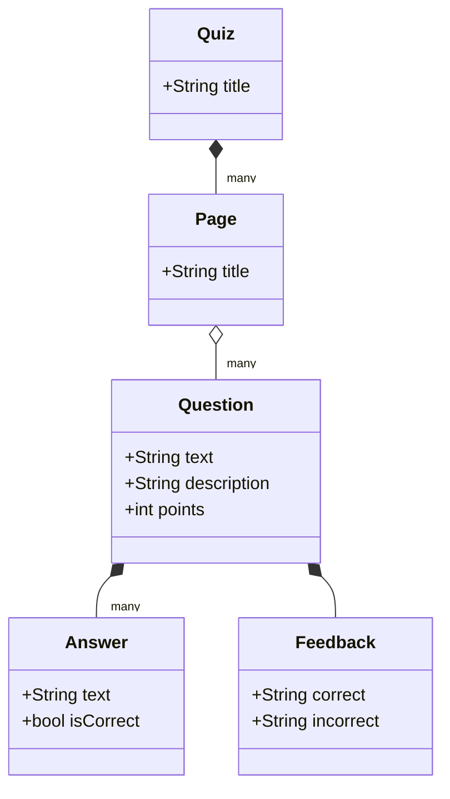

# Quizzical

## Description

The goal of the project is to automatically generate quizzes out of easily readable text files.

## Usage

1. A quiz is created in the [Markdown Format](###Markdown-Format)

2. TODO: The script (?) reads the human readable form and saves the result to a JSON file in the web.

3. The app script reads the json file and creates a google form with the quiz.

## Formats

### Domain Model



### Markdown Format

Correctness of a answer is indicated by the checkbox selection in the answer option.

NOTE: Using markdown to write the quiz isn't supported yet. For now, we are reading from a Google spreadsheet, found here: https://docs.google.com/spreadsheets/d/1YAnQRDM_V62QMl5mRvuoK0zaAphbv1fxyNpM6HbVLks/edit#gid=1965524460

```markdown
# <title of the quiz>

## <page title>

### <question>

<description of the question>

  * [ ] <incorrect answer>
  * [ ] <incorrect answer>
  * [x] <correct answer>
  * [ ] <incorrect answer>

Points: <number, e.g. 1>

#### Feedback
Correct: <feedback on correct answer>
Incorrect: <feedback on incorrect answer>
```

### JSON Format

```
{
    "title": "<title of the quiz>",
    "pages": [
        {
            "title": "<page title>",
            "questions": [
                {
                    "text": "<question itself>",
                    "description": "<description of the question>",
                    "answers": [
                        {
                            "text": "<answer to the question>",
                            "isCorrect": "<true/false>"
                        }
                    ],
                    "feedback": {
                        "correct": "<feedback for correct answer>",
                        "incorrect": "<feedback for incorrect answer>",
                        "link": "<link to more information>"
                    },
                    "points": "<number, e.g. 1>"
                }
            ]
        }
    ]
}
```
